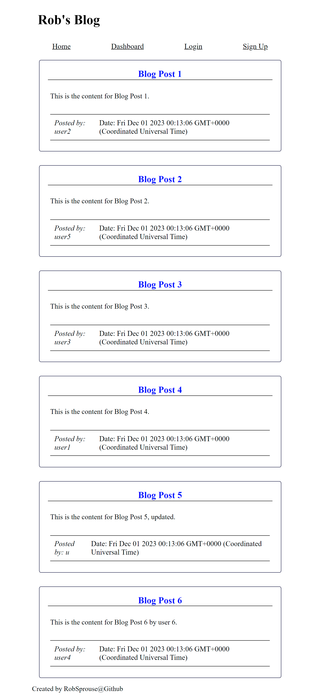
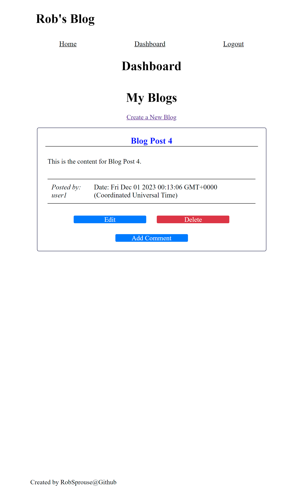
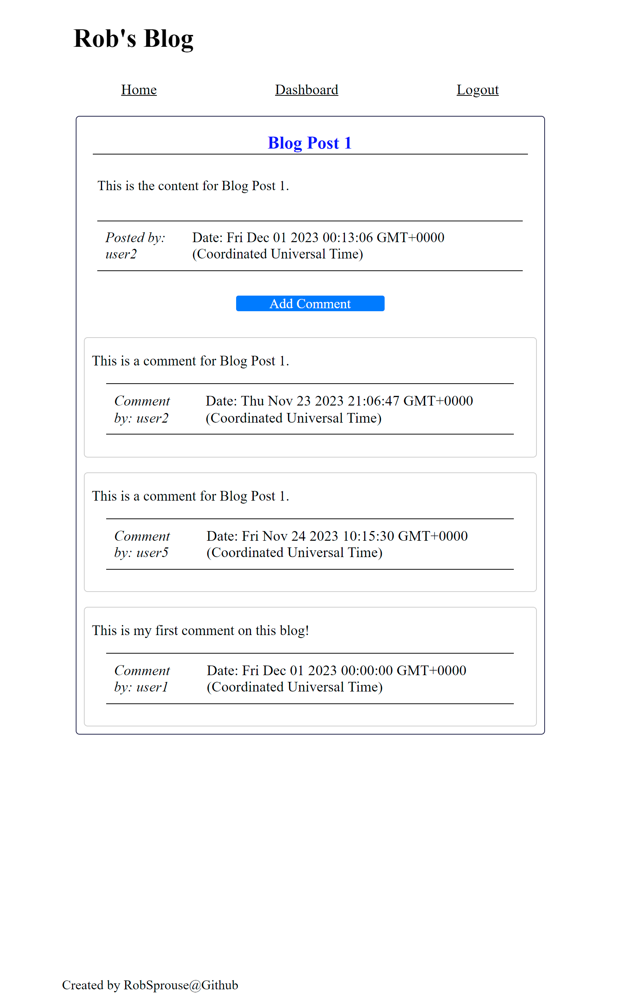

# Robs-blog

[](https://opensource.org/licenses/MIT)

## Description

This repository was created as a part of the University of Richmond's Bootcamp, Module 14 Challenge. This application is a demonstration of how to follow the MVC paradigm to create a CMS-style blog site similar to a Wordpress site, where developers can publish their blog posts and comment on other developers’ posts as well.

The following node modules are utilized in the deployment of this project:
`Express, MySQL2, Sequelize, dotenv, bcrypt, express-session, connect-session-sequelize, express-handlebars`

The following User Story and Acceptance Criteria were provided for this challenge:

> ## User Story
>
> ```md
> AS A developer who writes about tech
> I WANT a CMS-style blog site
> SO THAT I can publish articles, blog posts, and my thoughts and opinions
> ```
>
> ## Acceptance Criteria
>
> ```md
> GIVEN a CMS-style blog site
> WHEN I visit the site for the first time
> THEN I am presented with the homepage, which includes existing blog posts if any have been posted; navigation links for the homepage and the dashboard; and >the option to log in
> WHEN I click on the homepage option
> THEN I am taken to the homepage
> WHEN I click on any other links in the navigation
> THEN I am prompted to either sign up or sign in
> WHEN I choose to sign up
> THEN I am prompted to create a username and password
> WHEN I click on the sign-up button
> THEN my user credentials are saved and I am logged into the site
> WHEN I revisit the site at a later time and choose to sign in
> THEN I am prompted to enter my username and password
> WHEN I am signed in to the site
> THEN I see navigation links for the homepage, the dashboard, and the option to log out
> WHEN I click on the homepage option in the navigation
> THEN I am taken to the homepage and presented with existing blog posts that include the post title and the date created
> WHEN I click on an existing blog post
> THEN I am presented with the post title, contents, post creator’s username, and date created for that post and have the option to leave a comment
> WHEN I enter a comment and click on the submit button while signed in
> THEN the comment is saved and the post is updated to display the comment, the comment creator’s username, and the date created
> WHEN I click on the dashboard option in the navigation
> THEN I am taken to the dashboard and presented with any blog posts I have already created and the option to add a new blog post
> WHEN I click on the button to add a new blog post
> THEN I am prompted to enter both a title and contents for my blog post
> WHEN I click on the button to create a new blog post
> THEN the title and contents of my post are saved and I am taken back to an updated dashboard with my new blog post
> WHEN I click on one of my existing posts in the dashboard
> THEN I am able to delete or update my post and taken back to an updated dashboard
> WHEN I click on the logout option in the navigation
> THEN I am signed out of the site
> WHEN I am idle on the site for more than a set time
> THEN I am able to view posts and comments but I am prompted to log in again before I can add, update, or delete posts
> ```

## Table of Contents

-    [Installation](#installation)
-    [Usage](#usage)
-    [License](#license)
-    [Contributing](#contributing)
-    [Tests](#tests)
-    [Questions](#questions)

## Installation

This application is deployed on Heroku at the following link: [Rob's Blog](https://robs-blog-b0de7b1ff25d.herokuapp.com/) and does not require any installation to use. If you would like to install this application locally to see it in it's development environment, please follow the instructions below.

This application requires Node.js to run. Please visit https://nodejs.org/en/ to download Node.js if it is not already installed on your computer.

This application depends on connecting to an existing MySql server, either locally or over the internet. Please visit https://dev.mysql.com/downloads/mysql/ to download MySQL if it is not already installed on your computer. Once you have the ability to connect to a hosted MySql server, you can modify the connection parameters in the `config/connection.js` file if the default installation of MySQL wasn't chosen. This application is set up to pull the database login information from a `.env` file. The `./.env` file is not included in this repository because the upload of it is ignored in the .gitignore file. This is intentional to prevent login credentials from being uploaded to Github, however, there is an example `env.EXAMPLE` file provided. You can rename this file to `.env` and modify the parameters to match your MySql server login information. The following parameters are required in the `.env` file:

```md
DB_NAME='robsBlog_db'
DB_PASSWORD='<INSERT PASSWORD HERE>'
DB_USER='<INSERT USERNAME HERE>'
SESSION_SECRET=<INSERT SESSION_SECRET HERE> <!-- this is a random string of characters -->
```

If you are unfamiliar with cloning a repository, please click on the following link to learn: [Github docs | Cloning a repository](https://docs.github.com/en/repositories/creating-and-managing-repositories/cloning-a-repository)

To install this application, clone the repository, navigate to its directory in the terminal, and run `npm install` in the command line to install the required dependencies.

To setup the database, run the `schema.sql` schema file located in the `db` directory to create the database. This will drop the `robsblog_db` if it exists so do not do this if you have a database with that name containing data you wish to keep. When the server is started, the Sequelize models will be synced to the MySQL database, creating the tables. If you are unfamiliar with running MySql scripts, please click on the following link to learn: [MySQL docs | Executing SQL Statements from a Text File](https://dev.mysql.com/doc/refman/8.0/en/mysql-batch-commands.html)

If you want to interact with the database with sample seeded data, navigate to the parent directory of the repository in the terminal and enter the command `npm run seed`.

To view the application locally, navigate to the parent directory of the repository in the terminal and enter the command `npm start`. This will start the server and the application can be viewed in the browser at http://localhost:3001.

## Usage

This application is deployed on Heroku at the following link: [Rob's Blog](https://robs-blog-b0de7b1ff25d.herokuapp.com/) and does not require any installation to use.

Click on the link to view the application in your browser. Sign up for an account and it will log you in. Then you can start creating blog posts and comment on other users' posts.

To create a blog, click on the dashboard link and it will bring you to your dashboard where you're blogs will be displayed. Click on the "Create New Blog" button and it will bring you to a page where you can enter a title and the content of your blog. Click on the button to sumbit your blog and it will be saved to the database and displayed on your dashboard.

Click on an existing blog title to view the blog. A button will be present to add a comment to the blog. Click on the button and enter your comment. Click on the button to submit your comment and it will be saved to the database and displayed on the blog.

You can also edit or delete your blogs from your dashboard. Click on the edit button to edit your blog. Click on the delete button to delete your blog.

The following image shows the homepage of the application:

> 
> </br>

The following image shows the dashboard of the application:

> 
> </br>

The following image shows an individual blog page of the application:

> 
> </br>

## License

This application is licensed under the MIT license. See the following link for more information: https://opensource.org/licenses/MIT

## Contributing

Feel free to contribute to this project! Please fork the repository and create a pull request with your changes.

## Tests

No tests are included in this application.

## Questions

If you have any questions, please contact me at drgstriker@aol.com. You can also visit my GitHub profile at https://github.com/RobSprouse.
